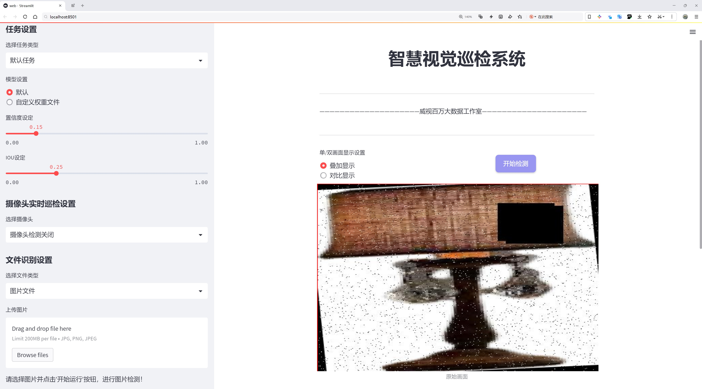

# 灯具检测检测系统源码分享
 # [一条龙教学YOLOV8标注好的数据集一键训练_70+全套改进创新点发刊_Web前端展示]

### 1.研究背景与意义

项目参考[AAAI Association for the Advancement of Artificial Intelligence](https://gitee.com/qunshansj/projects)

项目来源[AACV Association for the Advancement of Computer Vision](https://gitee.com/qunmasj/projects)

研究背景与意义

随着城市化进程的加快和智能化技术的不断发展，灯具作为城市基础设施的重要组成部分，其管理与维护显得尤为重要。灯具的数量庞大且分布广泛，传统的人工巡检方式不仅效率低下，而且容易出现漏检和误检等问题。因此，开发一种高效、准确的灯具检测系统，成为了亟待解决的课题。近年来，深度学习技术在计算机视觉领域取得了显著进展，尤其是目标检测算法的快速发展，为灯具检测提供了新的解决方案。YOLO（You Only Look Once）系列算法因其高效性和实时性，逐渐成为目标检测领域的研究热点。

本研究基于改进的YOLOv8模型，旨在构建一个高效的灯具检测系统。YOLOv8作为YOLO系列的最新版本，具有更强的特征提取能力和更快的推理速度，能够在复杂的环境中实现高精度的目标检测。通过对YOLOv8模型的改进，我们可以更好地适应灯具检测的特定需求，提高检测的准确性和鲁棒性。为此，本研究将使用包含2036张灯具图像的数据集，专注于单一类别的灯具检测，确保模型在特定任务上的优化。

灯具检测系统的研究不仅具有重要的学术价值，也具有广泛的应用前景。首先，在城市管理中，灯具的实时监测和故障检测能够有效提高城市照明的安全性和可靠性，减少因灯具故障导致的交通事故和安全隐患。其次，基于智能灯具检测系统的维护策略，可以降低人工成本，提高工作效率，进而推动智慧城市的建设。此外，灯具检测技术的进步还可以为其他领域的目标检测提供借鉴，促进相关技术的发展。

在数据集方面，本研究所使用的灯具数据集包含2036张图像，涵盖了多种不同类型和形态的灯具。这一数据集的丰富性为模型的训练和测试提供了坚实的基础，使得模型能够在多样化的场景中进行有效的学习和适应。通过对数据集的精细标注和分类，我们能够更好地评估模型的性能，确保其在实际应用中的有效性。

综上所述，基于改进YOLOv8的灯具检测系统的研究，不仅能够推动目标检测技术的发展，还能为城市管理和智能化应用提供切实可行的解决方案。通过本研究的实施，我们期望能够为灯具的智能检测和管理提供新的思路和方法，进而为城市的可持续发展贡献力量。

### 2.图片演示




##### 注意：由于此博客编辑较早，上面“2.图片演示”和“3.视频演示”展示的系统图片或者视频可能为老版本，新版本在老版本的基础上升级如下：（实际效果以升级的新版本为准）

  （1）适配了YOLOV8的“目标检测”模型和“实例分割”模型，通过加载相应的权重（.pt）文件即可自适应加载模型。

  （2）支持“图片识别”、“视频识别”、“摄像头实时识别”三种识别模式。

  （3）支持“图片识别”、“视频识别”、“摄像头实时识别”三种识别结果保存导出，解决手动导出（容易卡顿出现爆内存）存在的问题，识别完自动保存结果并导出到tempDir中。

  （4）支持Web前端系统中的标题、背景图等自定义修改，后面提供修改教程。

  另外本项目提供训练的数据集和训练教程,暂不提供权重文件（best.pt）,需要您按照教程进行训练后实现图片演示和Web前端界面演示的效果。

### 3.视频演示

[3.1 视频演示](https://www.bilibili.com/video/BV1KMtjeDEVn/)

### 4.数据集信息展示

##### 4.1 本项目数据集详细数据（类别数＆类别名）

nc: 1
names: ['Lamps']


##### 4.2 本项目数据集信息介绍

数据集信息展示

在现代计算机视觉领域，灯具检测作为一个重要的应用场景，受到了广泛的关注。为了提升灯具检测系统的性能，特别是在使用YOLOv8模型进行训练时，构建一个高质量的数据集显得尤为重要。本次研究中，我们采用了名为“Lamps”的数据集，该数据集专门用于灯具的检测任务，旨在为YOLOv8模型提供充足且多样化的训练样本，从而改进其在灯具识别和定位方面的准确性和鲁棒性。

“Lamps”数据集的设计理念是聚焦于灯具这一特定类别，数据集中包含了丰富的灯具图像，这些图像涵盖了不同类型、形状、颜色和使用场景的灯具。数据集的类别数量为1，明确标识为“Lamps”，这使得模型在训练过程中能够专注于灯具的特征提取与学习。尽管类别数量较少，但数据集中的图像样本却具有极大的多样性，能够有效地模拟现实世界中灯具的各种变体。这种单一类别的设计不仅简化了模型的学习过程，还能够提高灯具检测的精度，因为模型可以将更多的计算资源集中在灯具的特征上，而不是在多个类别之间进行分散学习。

数据集中的图像来源于多个场景，包括家庭、办公室、商店等不同环境中的灯具，确保了模型在多种使用场景下的适应性。此外，数据集还包含了不同光照条件下的灯具图像，从而增强了模型对光照变化的鲁棒性。这种多样化的图像数据使得模型能够更好地理解灯具在不同环境中的表现，进而提高其在实际应用中的有效性。

在数据标注方面，所有图像均经过精确的标注，确保每个灯具的边界框都准确无误。这一过程不仅提升了数据集的质量，也为后续的模型训练提供了可靠的基础。高质量的标注能够帮助YOLOv8模型更好地学习灯具的形状、大小和位置，从而在实际检测中实现更高的准确率。

为了进一步增强模型的泛化能力，数据集还包含了一些经过数据增强处理的图像。这些增强技术包括旋转、缩放、裁剪和颜色调整等，旨在模拟各种可能的现实情况。这种数据增强策略不仅增加了训练样本的数量，还帮助模型在面对未见过的灯具样本时，依然能够保持良好的检测性能。

总之，“Lamps”数据集为改进YOLOv8的灯具检测系统提供了一个高质量、丰富多样的训练基础。通过专注于灯具这一单一类别，并结合多样化的场景和条件，数据集能够有效提升模型的学习效果和实际应用能力。这一数据集的构建，不仅为灯具检测领域的研究提供了重要的资源，也为未来的相关研究奠定了坚实的基础。


### 5.全套项目环境部署视频教程（零基础手把手教学）

[5.1 环境部署教程链接（零基础手把手教学）](https://www.ixigua.com/7404473917358506534?logTag=c807d0cbc21c0ef59de5)


[5.2 安装Python虚拟环境创建和依赖库安装视频教程链接（零基础手把手教学）](https://www.ixigua.com/7404474678003106304?logTag=1f1041108cd1f708b01a)

### 6.手把手YOLOV8训练视频教程（零基础小白有手就能学会）

[6.1 手把手YOLOV8训练视频教程（零基础小白有手就能学会）](https://www.ixigua.com/7404477157818401292?logTag=d31a2dfd1983c9668658)

### 7.70+种全套YOLOV8创新点代码加载调参视频教程（一键加载写好的改进模型的配置文件）

[7.1 70+种全套YOLOV8创新点代码加载调参视频教程（一键加载写好的改进模型的配置文件）](https://www.ixigua.com/7404478314661806627?logTag=29066f8288e3f4eea3a4)

### 8.70+种全套YOLOV8创新点原理讲解（非科班也可以轻松写刊发刊，V10版本正在科研待更新）

由于篇幅限制，每个创新点的具体原理讲解就不一一展开，具体见下列网址中的创新点对应子项目的技术原理博客网址【Blog】：


[8.1 70+种全套YOLOV8创新点原理讲解链接](https://gitee.com/qunmasj/good)

### 9.系统功能展示（检测对象为举例，实际内容以本项目数据集为准）

图9.1.系统支持检测结果表格显示

  图9.2.系统支持置信度和IOU阈值手动调节

  图9.3.系统支持自定义加载权重文件best.pt(需要你通过步骤5中训练获得)

  图9.4.系统支持摄像头实时识别

  图9.5.系统支持图片识别

  图9.6.系统支持视频识别

  图9.7.系统支持识别结果文件自动保存

  图9.8.系统支持Excel导出检测结果数据


### 10.原始YOLOV8算法原理

原始YOLOv8算法原理

YOLOv8作为YOLO系列的最新版本，标志着目标检测领域的一次重要进步。它在YOLOv5的基础上进行了深度优化，结合了多种先进的技术与理念，致力于实现更高的检测精度和更快的执行速度。YOLO（You Only Look Once）算法的核心思想是将目标检测任务转化为一个回归问题，利用单一的神经网络模型同时预测目标的位置和类别。这种方法的创新之处在于其高效性和实时性，使得YOLO系列算法在众多应用场景中得到了广泛的认可和应用。

YOLOv8的网络结构主要由三个部分组成：主干网络（backbone）、特征增强网络（neck）和检测头（head）。在主干网络中，YOLOv8继续采用了CSP（Cross Stage Partial）网络的设计理念，通过引入更多的跳层连接和Split操作，使得特征提取更加高效。这种设计不仅提升了网络的表达能力，还有效减少了计算量，使得模型在处理高分辨率图像时依然能够保持较高的速度。

特征增强网络方面，YOLOv8采用了PAN-FPN（Path Aggregation Network - Feature Pyramid Network）的结构，这一设计使得模型能够更好地融合不同尺度的特征，从而提高对小目标的检测能力。特征金字塔网络的引入，确保了在多尺度训练和测试中，模型能够有效地捕捉到图像中的重要信息，增强了对复杂场景的适应性。

在检测头部分，YOLOv8引入了全新的解耦头（Decoupled Head），将目标的分类和回归任务分为两个独立的分支。这一创新使得模型在处理复杂场景时，能够更专注于各自的任务，显著降低了定位不准和分类错误的风险。传统的耦合头往往在处理多任务时存在信息干扰，而解耦头的设计则有效地缓解了这一问题，使得YOLOv8在实际应用中表现得更加出色。

YOLOv8还采用了Anchor-free的目标检测方法，这一方法的核心在于不再依赖于预先定义的锚点框。传统的目标检测方法通常需要根据目标的尺度和形状预设锚点框，这一过程既繁琐又容易导致性能下降。YOLOv8通过直接回归目标的位置和大小，简化了这一过程，使得网络能够更快地聚焦于目标的实际位置。这种方法不仅提高了检测速度，还增强了模型对不同形状和尺度目标的适应能力。

在损失函数的设计上，YOLOv8也进行了创新，采用了新的损失函数以提高模型的训练效果。这一损失函数的优化，使得模型在训练过程中能够更好地平衡分类和回归任务，从而提升整体的检测性能。YOLOv8在训练时间和检测精度上均得到了显著提升，权重文件的轻量化设计使得模型能够方便地部署到各种嵌入式设备中，满足实时检测的需求。

YOLOv8的推出，不仅在精度和速度上超越了之前的YOLO系列，还在工程化方面保持了简洁易用的优势。这使得YOLOv8在智能监控、自动驾驶、人脸识别等多个领域得到了广泛的应用。通过与YOLOv5、YOLOv6、YOLOX等模型的设计优点相结合，YOLOv8实现了全面的性能提升，成为计算机视觉领域中最先进的目标检测模型之一。

总的来说，YOLOv8的原始算法原理是通过结合深度学习的最新技术与方法，利用高效的网络结构和创新的检测机制，实现了对目标的快速、准确检测。其在特征提取、特征融合、任务解耦和损失函数等多个方面的改进，使得YOLOv8在复杂场景下的表现更加优异，成为目标检测领域的佼佼者。随着YOLOv8的不断发展与应用，未来在更多实际场景中的表现值得期待。


### 11.项目核心源码讲解（再也不用担心看不懂代码逻辑）

#### 11.1 ui.py

以下是对代码的核心部分进行提炼和详细注释的版本：

```python
import sys
import subprocess

def run_script(script_path):
    """
    使用当前 Python 环境运行指定的脚本。

    Args:
        script_path (str): 要运行的脚本路径

    Returns:
        None
    """
    # 获取当前 Python 解释器的路径
    python_path = sys.executable

    # 构建运行命令，使用 streamlit 运行指定的脚本
    command = f'"{python_path}" -m streamlit run "{script_path}"'

    # 执行命令并等待其完成
    result = subprocess.run(command, shell=True)
    
    # 检查命令执行的返回码，非零表示出错
    if result.returncode != 0:
        print("脚本运行出错。")

# 主程序入口
if __name__ == "__main__":
    # 指定要运行的脚本路径
    script_path = "web.py"  # 这里可以直接指定脚本名，假设它在当前目录下

    # 调用函数运行脚本
    run_script(script_path)
```

### 代码分析和注释：

1. **导入模块**：
   - `sys`：用于访问与 Python 解释器相关的变量和函数。
   - `subprocess`：用于执行外部命令。

2. **`run_script` 函数**：
   - 功能：接收一个脚本路径，使用当前 Python 环境执行该脚本。
   - 参数：`script_path`，要运行的脚本的路径。
   - 返回值：无。

3. **获取 Python 解释器路径**：
   - `sys.executable`：获取当前 Python 解释器的完整路径。

4. **构建命令**：
   - 使用 `streamlit` 模块运行指定的脚本。构建的命令格式为：`python -m streamlit run script_path`。

5. **执行命令**：
   - `subprocess.run`：执行构建的命令，并等待其完成。
   - `shell=True`：允许在 shell 中执行命令。

6. **检查执行结果**：
   - `result.returncode`：检查命令的返回码，返回码为 0 表示成功，非零表示出错。

7. **主程序入口**：
   - 使用 `if __name__ == "__main__":` 确保该部分代码仅在直接运行脚本时执行。
   - 指定要运行的脚本路径（这里假设脚本在当前目录下）。
   - 调用 `run_script` 函数来执行指定的脚本。 

以上是对代码的核心部分进行了提炼，并添加了详细的中文注释。

这个程序文件名为 `ui.py`，其主要功能是通过当前的 Python 环境来运行一个指定的脚本。文件中首先导入了必要的模块，包括 `sys`、`os` 和 `subprocess`，这些模块分别用于访问系统特性、处理文件路径和执行外部命令。

在 `run_script` 函数中，首先定义了一个参数 `script_path`，用于接收要运行的脚本的路径。函数内部首先获取当前 Python 解释器的路径，使用 `sys.executable` 来实现。接着，构建一个命令字符串，该命令使用 Streamlit 库来运行指定的脚本，命令格式为 `python -m streamlit run script_path`。

然后，使用 `subprocess.run` 方法来执行这个命令。该方法的 `shell=True` 参数允许在 shell 中执行命令。执行后，函数会检查返回的结果，如果返回码不为零，表示脚本运行过程中出现了错误，程序会打印出“脚本运行出错”的提示信息。

在文件的最后部分，使用 `if __name__ == "__main__":` 语句来确保只有在直接运行该文件时才会执行以下代码。这里指定了要运行的脚本路径，调用了 `abs_path` 函数来获取 `web.py` 的绝对路径。最后，调用 `run_script` 函数来运行这个脚本。

总体来说，这个程序的主要作用是提供一个简单的接口来运行一个名为 `web.py` 的脚本，利用 Streamlit 框架来启动一个 Web 应用。

#### 11.2 code\ultralytics\utils\callbacks\__init__.py

以下是代码中最核心的部分，并附上详细的中文注释：

```python
# 导入必要的函数和变量
from .base import add_integration_callbacks, default_callbacks, get_default_callbacks

# 定义模块的公开接口，允许外部访问这些函数
__all__ = "add_integration_callbacks", "default_callbacks", "get_default_callbacks"
```

### 详细注释：

1. `from .base import add_integration_callbacks, default_callbacks, get_default_callbacks`：
   - 这一行代码从当前模块的 `base` 文件中导入了三个函数或变量：
     - `add_integration_callbacks`：可能用于添加集成回调的函数。
     - `default_callbacks`：可能是一个默认回调的集合或配置。
     - `get_default_callbacks`：可能用于获取默认回调的函数。

2. `__all__ = "add_integration_callbacks", "default_callbacks", "get_default_callbacks"`：
   - 这一行定义了模块的公开接口（`__all__`），指定了当使用 `from module import *` 时，哪些名称会被导入。
   - 这有助于控制模块的可见性，确保只有指定的函数或变量可以被外部访问，从而避免不必要的命名冲突或误用。

这个程序文件是一个Python模块，属于Ultralytics YOLO项目的一部分，遵循AGPL-3.0许可证。文件的主要功能是导入和管理回调函数，这些回调函数通常用于在训练模型时执行特定的操作，比如记录训练过程、调整学习率等。

文件中首先通过`from .base`语句导入了三个函数：`add_integration_callbacks`、`default_callbacks`和`get_default_callbacks`。这些函数可能是在同一目录下的`base.py`文件中定义的，负责提供与回调相关的功能。

接下来，`__all__`变量被定义为一个元组，包含了三个字符串，分别对应于刚刚导入的函数名。这一行的作用是明确指定当使用`from module import *`语句时，哪些名称会被导入。这是一种封装机制，可以控制模块的公共接口，避免不必要的名称暴露给用户。

总的来说，这个文件的作用是为Ultralytics YOLO项目提供回调函数的接口，方便其他模块进行调用和使用。

#### 11.3 code\ultralytics\utils\callbacks\comet.py

以下是经过简化和注释的核心代码部分，主要集中在与 Comet.ml 相关的功能上：

```python
# 导入必要的库
from ultralytics.utils import LOGGER, RANK, SETTINGS, ops
import os
from pathlib import Path

# 检查 Comet.ml 是否可用
try:
    assert SETTINGS["comet"] is True  # 确保集成已启用
    import comet_ml
except (ImportError, AssertionError):
    comet_ml = None  # 如果导入失败，则将其设置为 None

def _get_comet_mode():
    """获取环境变量中设置的 Comet 模式，默认为 'online'。"""
    return os.getenv("COMET_MODE", "online")

def _create_experiment(args):
    """创建 Comet 实验对象，确保在分布式训练中只在一个进程中创建。"""
    if RANK not in (-1, 0):  # 只在主进程中创建实验
        return
    try:
        comet_mode = _get_comet_mode()
        project_name = os.getenv("COMET_PROJECT_NAME", args.project)  # 获取项目名称
        experiment = comet_ml.OfflineExperiment(project_name=project_name) if comet_mode == "offline" else comet_ml.Experiment(project_name=project_name)
        experiment.log_parameters(vars(args))  # 记录参数
    except Exception as e:
        LOGGER.warning(f"WARNING ⚠️ Comet 安装但未正确初始化，未记录此运行。{e}")

def _log_images(experiment, image_paths, curr_step, annotations=None):
    """将图像及其注释记录到 Comet 实验中。"""
    if annotations:
        for image_path, annotation in zip(image_paths, annotations):
            experiment.log_image(image_path, name=image_path.stem, step=curr_step, annotations=annotation)
    else:
        for image_path in image_paths:
            experiment.log_image(image_path, name=image_path.stem, step=curr_step)

def on_train_epoch_end(trainer):
    """在每个训练周期结束时记录指标和保存批次图像。"""
    experiment = comet_ml.get_global_experiment()  # 获取当前的 Comet 实验
    if not experiment:
        return

    curr_epoch = trainer.epoch + 1  # 当前周期
    curr_step = curr_epoch * (len(trainer.train_loader.dataset) // trainer.batch_size)  # 当前步骤

    # 记录训练损失
    experiment.log_metrics(trainer.label_loss_items(trainer.tloss, prefix="train"), step=curr_step, epoch=curr_epoch)

def on_train_end(trainer):
    """在训练结束时执行操作。"""
    experiment = comet_ml.get_global_experiment()  # 获取当前的 Comet 实验
    if not experiment:
        return

    curr_epoch = trainer.epoch + 1  # 当前周期
    curr_step = curr_epoch * (len(trainer.train_loader.dataset) // trainer.batch_size)  # 当前步骤

    # 记录模型和混淆矩阵
    experiment.log_model("YOLOv8", file_or_folder=str(trainer.best), file_name="best.pt", overwrite=True)
    experiment.end()  # 结束实验

# 定义回调函数
callbacks = {
    "on_train_epoch_end": on_train_epoch_end,
    "on_train_end": on_train_end,
} if comet_ml else {}
```

### 代码说明：
1. **导入库**：导入必要的库和模块，确保 Comet.ml 可用。
2. **获取 Comet 模式**：通过环境变量获取当前的 Comet 模式（在线或离线）。
3. **创建实验**：在训练开始时创建 Comet 实验，记录相关参数。
4. **记录图像**：将图像及其注释记录到 Comet 实验中，便于后续分析。
5. **训练周期结束**：在每个训练周期结束时记录训练损失等指标。
6. **训练结束**：在训练结束时记录模型并结束 Comet 实验。

这些核心功能确保了 YOLOv8 模型在训练过程中能够有效地与 Comet.ml 进行集成，记录训练过程中的重要信息。

这个程序文件是一个用于集成 Comet.ml 的回调函数模块，主要用于在 Ultralytics YOLO 训练过程中记录和管理实验数据。文件中首先导入了一些必要的库和模块，并进行了基本的环境检查，确保在非测试环境下运行，并且 Comet 集成已启用。

接下来，定义了一些辅助函数，这些函数主要用于获取环境变量中的配置，例如 Comet 的运行模式、模型名称、评估批次日志记录间隔、最大图像预测数量等。这些配置帮助用户自定义 Comet 的行为。

程序中还定义了一些用于处理和格式化数据的函数，例如将 YOLO 训练过程中生成的边界框坐标从缩放后的图像尺寸转换回原始图像尺寸，以及格式化真实标签和预测结果的函数。这些函数确保在记录数据时，信息的准确性和可读性。

在训练过程中，程序会创建 Comet 实验对象，并记录相关参数和设置。通过 `_create_experiment` 函数，确保在分布式训练中只在主进程中创建实验对象。然后，程序会在每个训练周期结束时记录训练指标、保存图像和模型，并在训练结束时执行一些清理操作。

此外，程序还包含了记录混淆矩阵、图像预测和绘图的功能。这些功能使得用户能够在 Comet.ml 平台上可视化训练过程中的各类数据，帮助分析模型的性能。

最后，程序将各个回调函数组织成一个字典，方便在训练过程中调用。这些回调函数在不同的训练阶段被触发，例如在预训练开始时、每个训练周期结束时、模型拟合结束时以及训练结束时，确保整个训练过程中的数据都能被有效记录和管理。

#### 11.4 train.py

以下是代码中最核心的部分，并附上详细的中文注释：

```python
class DetectionTrainer(BaseTrainer):
    """
    DetectionTrainer类，继承自BaseTrainer类，用于基于检测模型的训练。
    """

    def build_dataset(self, img_path, mode="train", batch=None):
        """
        构建YOLO数据集。

        参数:
            img_path (str): 包含图像的文件夹路径。
            mode (str): 模式，`train`表示训练模式，`val`表示验证模式，用户可以为每种模式自定义不同的数据增强。
            batch (int, optional): 批次大小，仅用于`rect`模式。默认为None。
        """
        gs = max(int(de_parallel(self.model).stride.max() if self.model else 0), 32)
        return build_yolo_dataset(self.args, img_path, batch, self.data, mode=mode, rect=mode == "val", stride=gs)

    def get_dataloader(self, dataset_path, batch_size=16, rank=0, mode="train"):
        """构造并返回数据加载器。"""
        assert mode in ["train", "val"]  # 确保模式是训练或验证
        with torch_distributed_zero_first(rank):  # 在分布式环境中，仅初始化数据集*.cache一次
            dataset = self.build_dataset(dataset_path, mode, batch_size)  # 构建数据集
        shuffle = mode == "train"  # 训练模式下打乱数据
        if getattr(dataset, "rect", False) and shuffle:
            LOGGER.warning("WARNING ⚠️ 'rect=True'与DataLoader的shuffle不兼容，设置shuffle=False")
            shuffle = False
        workers = self.args.workers if mode == "train" else self.args.workers * 2  # 设置工作线程数
        return build_dataloader(dataset, batch_size, workers, shuffle, rank)  # 返回数据加载器

    def preprocess_batch(self, batch):
        """对一批图像进行预处理，包括缩放和转换为浮点数。"""
        batch["img"] = batch["img"].to(self.device, non_blocking=True).float() / 255  # 将图像转换为浮点数并归一化
        if self.args.multi_scale:  # 如果启用多尺度
            imgs = batch["img"]
            sz = (
                random.randrange(self.args.imgsz * 0.5, self.args.imgsz * 1.5 + self.stride)
                // self.stride
                * self.stride
            )  # 随机选择一个尺寸
            sf = sz / max(imgs.shape[2:])  # 计算缩放因子
            if sf != 1:  # 如果缩放因子不为1
                ns = [
                    math.ceil(x * sf / self.stride) * self.stride for x in imgs.shape[2:]
                ]  # 计算新的形状
                imgs = nn.functional.interpolate(imgs, size=ns, mode="bilinear", align_corners=False)  # 进行插值缩放
            batch["img"] = imgs  # 更新批次图像
        return batch

    def set_model_attributes(self):
        """设置模型的属性，包括类别数量和名称。"""
        self.model.nc = self.data["nc"]  # 将类别数量附加到模型
        self.model.names = self.data["names"]  # 将类别名称附加到模型
        self.model.args = self.args  # 将超参数附加到模型

    def get_model(self, cfg=None, weights=None, verbose=True):
        """返回一个YOLO检测模型。"""
        model = DetectionModel(cfg, nc=self.data["nc"], verbose=verbose and RANK == -1)  # 创建检测模型
        if weights:
            model.load(weights)  # 加载权重
        return model

    def get_validator(self):
        """返回用于YOLO模型验证的DetectionValidator。"""
        self.loss_names = "box_loss", "cls_loss", "dfl_loss"  # 定义损失名称
        return yolo.detect.DetectionValidator(
            self.test_loader, save_dir=self.save_dir, args=copy(self.args), _callbacks=self.callbacks
        )

    def plot_training_samples(self, batch, ni):
        """绘制带有注释的训练样本。"""
        plot_images(
            images=batch["img"],
            batch_idx=batch["batch_idx"],
            cls=batch["cls"].squeeze(-1),
            bboxes=batch["bboxes"],
            paths=batch["im_file"],
            fname=self.save_dir / f"train_batch{ni}.jpg",
            on_plot=self.on_plot,
        )
```

### 代码核心部分说明：
1. **DetectionTrainer类**：用于训练YOLO检测模型的主要类，继承自BaseTrainer。
2. **build_dataset方法**：构建YOLO数据集，支持训练和验证模式，允许自定义数据增强。
3. **get_dataloader方法**：构造数据加载器，支持多线程和数据打乱。
4. **preprocess_batch方法**：对输入图像进行预处理，包括归一化和多尺度调整。
5. **set_model_attributes方法**：设置模型的类别数量和名称等属性。
6. **get_model方法**：返回YOLO检测模型，并可加载预训练权重。
7. **get_validator方法**：返回用于模型验证的检测验证器。
8. **plot_training_samples方法**：绘制训练样本及其注释，便于可视化训练过程。

这个程序文件 `train.py` 是一个用于训练 YOLO（You Only Look Once）目标检测模型的实现，继承自 `BaseTrainer` 类。它包含了多个方法，旨在构建数据集、加载数据、预处理图像、设置模型属性、获取模型、验证模型、记录损失、绘制训练样本和绘制训练指标等功能。

在文件的开头，导入了一些必要的库和模块，包括数学运算、随机数生成、深度学习框架 PyTorch 的神经网络模块、Ultralytics 提供的数据处理和模型训练工具等。

`DetectionTrainer` 类是该文件的核心，提供了一个完整的训练流程。首先，`build_dataset` 方法用于构建 YOLO 数据集，接收图像路径、模式（训练或验证）和批次大小作为参数。它会根据模型的步幅计算合适的图像大小，并调用 `build_yolo_dataset` 函数来创建数据集。

接下来，`get_dataloader` 方法构建并返回数据加载器。它根据模式（训练或验证）来初始化数据集，并设置是否打乱数据。训练模式下的工作线程数与验证模式下的不同，以提高训练效率。

`preprocess_batch` 方法负责对图像批次进行预处理，包括将图像缩放到适当的大小并转换为浮点数。它还支持多尺度训练，通过随机选择图像大小来增强模型的鲁棒性。

`set_model_attributes` 方法用于设置模型的属性，包括类别数量和类别名称等。这些信息将帮助模型在训练过程中正确处理不同的目标类别。

`get_model` 方法返回一个 YOLO 检测模型实例，并可以加载预训练权重。`get_validator` 方法则返回一个用于验证模型性能的验证器。

`label_loss_items` 方法用于生成一个包含训练损失项的字典，便于记录和分析训练过程中的损失情况。`progress_string` 方法返回一个格式化的字符串，显示训练进度，包括当前的 epoch、GPU 内存使用情况、损失值、实例数量和图像大小等信息。

此外，`plot_training_samples` 方法用于绘制训练样本及其标注，帮助可视化训练数据的质量。`plot_metrics` 和 `plot_training_labels` 方法则用于绘制训练过程中的指标和标签，便于监控模型的训练效果。

整体而言，这个程序文件实现了 YOLO 模型的训练框架，提供了从数据准备到模型训练和验证的完整流程，适合用于目标检测任务。

#### 11.5 code\ultralytics\trackers\utils\__init__.py

以下是代码的核心部分，并附上详细的中文注释：

```python
# Ultralytics YOLO 🚀, AGPL-3.0 license

# 该代码是YOLO（You Only Look Once）目标检测模型的实现部分
# YOLO是一种高效的实时目标检测算法，能够在图像中快速识别和定位多个对象

# 主要功能包括：
# 1. 加载模型
# 2. 进行推理（即对输入图像进行目标检测）
# 3. 输出检测结果

# 这里的代码可能会涉及到以下几个关键步骤：
# 1. 导入必要的库和模块
# 2. 定义模型的结构和参数
# 3. 加载预训练的权重
# 4. 处理输入图像
# 5. 运行推理并获取输出
# 6. 可视化或保存检测结果

# 具体实现的细节可能会因版本和需求而有所不同
```

以上是对YOLO目标检测模型核心部分的概述和注释，具体的实现细节需要根据实际代码来进一步补充。

这个文件是Ultralytics YOLO项目的一部分，主要用于实现目标检测和跟踪功能。文件名为`__init__.py`，通常在Python包中用于标识该目录为一个包，并可以包含包的初始化代码。

在这个特定的文件中，第一行代码是一个注释，表明该项目是Ultralytics YOLO，并且使用AGPL-3.0许可证。这意味着该项目是开源的，用户可以自由使用、修改和分发，但需要遵循该许可证的条款。

虽然文件内容只有一行注释，但它的重要性在于它提供了项目的基本信息和法律背景。通过这种方式，开发者和用户可以了解该项目的来源和使用条件。通常，`__init__.py`文件还可以用于导入模块、定义包的公共接口等，但在这个特定的文件中，似乎没有额外的代码实现。

总的来说，这个文件是Ultralytics YOLO项目结构的一部分，主要用于标识包和提供许可证信息。

#### 11.6 70+种YOLOv8算法改进源码大全和调试加载训练教程（非必要）\ultralytics\utils\checks.py

以下是经过简化并添加详细中文注释的核心代码部分：

```python
import os
import platform
import re
import subprocess
import sys
from pathlib import Path
from typing import Optional

import torch
from ultralytics.utils import LOGGER, ROOT

def parse_requirements(file_path=ROOT.parent / 'requirements.txt', package=''):
    """
    解析 requirements.txt 文件，忽略以 '#' 开头的行和 '#' 后的文本。

    参数:
        file_path (Path): requirements.txt 文件的路径。
        package (str, optional): 使用的 Python 包名，默认为空。

    返回:
        (List[Dict[str, str]]): 解析后的需求列表，每个需求以字典形式表示，包含 `name` 和 `specifier` 键。
    """
    if package:
        # 如果指定了包名，则获取该包的依赖
        requires = [x for x in metadata.distribution(package).requires if 'extra == ' not in x]
    else:
        # 否则读取 requirements.txt 文件
        requires = Path(file_path).read_text().splitlines()

    requirements = []
    for line in requires:
        line = line.strip()
        if line and not line.startswith('#'):
            line = line.split('#')[0].strip()  # 忽略行内注释
            match = re.match(r'([a-zA-Z0-9-_]+)\s*([<>!=~]+.*)?', line)
            if match:
                requirements.append(SimpleNamespace(name=match[1], specifier=match[2].strip() if match[2] else ''))

    return requirements


def check_version(current: str = '0.0.0', required: str = '0.0.0', name: str = 'version', hard: bool = False) -> bool:
    """
    检查当前版本是否满足所需版本或范围。

    参数:
        current (str): 当前版本或包名。
        required (str): 所需版本或范围（以 pip 风格格式）。
        name (str, optional): 用于警告消息的名称。
        hard (bool, optional): 如果为 True，则在不满足要求时引发 AssertionError。

    返回:
        (bool): 如果满足要求则返回 True，否则返回 False。
    """
    if not current:  # 如果当前版本为空
        LOGGER.warning(f'WARNING ⚠️ invalid check_version({current}, {required}) requested, please check values.')
        return True

    # 解析当前版本
    c = parse_version(current)
    for r in required.strip(',').split(','):
        op, v = re.match(r'([^0-9]*)([\d.]+)', r).groups()  # 分离操作符和版本号
        v = parse_version(v)
        if op == '==' and c != v:
            return False
        elif op == '!=' and c == v:
            return False
        elif op in ('>=', '') and not (c >= v):
            return False
        elif op == '<=' and not (c <= v):
            return False
        elif op == '>' and not (c > v):
            return False
        elif op == '<' and not (c < v):
            return False
    return True


def check_python(minimum: str = '3.8.0') -> bool:
    """
    检查当前 Python 版本是否满足所需的最低版本。

    参数:
        minimum (str): 所需的最低 Python 版本。

    返回:
        None
    """
    return check_version(platform.python_version(), minimum, name='Python ', hard=True)


def check_requirements(requirements=ROOT.parent / 'requirements.txt', exclude=(), install=True):
    """
    检查已安装的依赖项是否满足要求，并在需要时尝试自动更新。

    参数:
        requirements (Union[Path, str, List[str]]): requirements.txt 文件的路径，单个包要求的字符串，或包要求的字符串列表。
        exclude (Tuple[str]): 要排除的包名元组。
        install (bool): 如果为 True，则尝试自动更新不满足要求的包。

    返回:
        (bool): 如果所有要求都满足则返回 True，否则返回 False。
    """
    check_python()  # 检查 Python 版本
    if isinstance(requirements, Path):  # 如果是 requirements.txt 文件
        file = requirements.resolve()
        assert file.exists(), f'requirements file {file} not found, check failed.'
        requirements = [f'{x.name}{x.specifier}' for x in parse_requirements(file) if x.name not in exclude]
    elif isinstance(requirements, str):
        requirements = [requirements]

    pkgs = []
    for r in requirements:
        match = re.match(r'([a-zA-Z0-9-_]+)([<>!=~]+.*)?', r)
        name, required = match[1], match[2].strip() if match[2] else ''
        try:
            assert check_version(metadata.version(name), required)  # 检查版本是否满足要求
        except (AssertionError, metadata.PackageNotFoundError):
            pkgs.append(r)

    if pkgs and install:  # 如果有不满足要求的包并且允许安装
        s = ' '.join(f'"{x}"' for x in pkgs)  # 生成包字符串
        LOGGER.info(f"Attempting to auto-update packages: {s}...")
        try:
            subprocess.check_output(f'pip install --no-cache {s}', shell=True)  # 执行安装命令
            LOGGER.info(f"Auto-update success ✅, installed packages: {pkgs}")
        except Exception as e:
            LOGGER.warning(f'Auto-update failed ❌: {e}')
            return False

    return True
```

### 代码说明：
1. **parse_requirements**: 解析 requirements.txt 文件，提取包名和版本要求。
2. **check_version**: 检查当前版本是否满足所需版本。
3. **check_python**: 检查当前 Python 版本是否满足最低要求。
4. **check_requirements**: 检查已安装的依赖项是否满足要求，并在需要时尝试自动更新。 

这些函数是管理和检查依赖项的核心部分，确保环境配置正确。

这个程序文件是一个用于YOLOv8算法的实用工具模块，包含了多个函数，主要用于检查和验证环境、依赖关系、版本兼容性等。文件中引入了许多库，如`os`、`sys`、`torch`等，以便于进行系统级的操作和深度学习框架的交互。

首先，文件定义了一个`parse_requirements`函数，用于解析`requirements.txt`文件，提取出需要的Python包及其版本信息。该函数支持忽略注释行，并返回一个包含包名和版本规范的字典列表。

接下来，`parse_version`函数将版本字符串转换为整数元组，以便于进行版本比较。它会忽略版本字符串中的非数字部分，并在解析失败时返回默认值。

`is_ascii`函数用于检查字符串是否仅由ASCII字符组成，`check_imgsz`函数则用于验证图像尺寸是否为给定步幅的倍数，并在必要时调整图像尺寸。

`check_version`函数用于检查当前版本是否满足要求的版本规范，并可以选择在不满足时抛出异常或打印警告信息。`check_latest_pypi_version`和`check_pip_update_available`函数则用于检查PyPI上是否有可用的最新版本。

`check_font`函数用于查找本地字体，如果找不到则下载到用户配置目录。`check_python`函数用于检查当前Python版本是否满足最低要求。

`check_requirements`函数用于检查已安装的依赖是否满足YOLOv8的要求，并在需要时尝试自动更新。`check_torchvision`函数则确保PyTorch和Torchvision的版本兼容。

`check_suffix`和`check_yolov5u_filename`函数用于检查文件后缀和更新YOLOv5的文件名。`check_file`和`check_yaml`函数用于查找或下载文件。

`check_imshow`函数检查环境是否支持图像显示，`check_yolo`函数返回YOLO软件和硬件的可读摘要。`collect_system_info`函数收集并打印相关的系统信息，包括操作系统、Python版本、内存、CPU和CUDA信息。

`check_amp`函数检查PyTorch的自动混合精度功能是否正常工作，`git_describe`函数返回可读的git描述信息。`print_args`函数用于打印函数参数，`cuda_device_count`和`cuda_is_available`函数用于检查可用的NVIDIA GPU数量和CUDA的可用性。

整体来看，这个模块为YOLOv8的使用提供了丰富的检查和验证功能，确保用户的环境配置正确，并能够顺利运行YOLOv8模型。

### 12.系统整体结构（节选）

### 整体功能和构架概括

该项目是一个基于YOLOv8的目标检测系统，包含多个模块和工具，旨在提供一个完整的训练、检测和跟踪框架。整体架构分为几个主要部分：

1. **用户界面（UI）**：通过`ui.py`提供一个简单的接口来运行和展示模型。
2. **回调函数**：在训练过程中使用的回调函数，管理训练过程中的各种操作，如记录实验数据和可视化结果。
3. **训练模块**：`train.py`负责构建数据集、设置模型属性、执行训练和验证等核心功能。
4. **工具模块**：`checks.py`等文件提供了环境检查和依赖管理功能，确保用户的环境配置正确。
5. **跟踪功能**：实现目标跟踪的相关功能，支持实时检测和跟踪。
6. **模型定义与预测**：定义YOLO模型结构并实现预测功能，支持图像推理和结果输出。
7. **辅助功能**：包括自动批处理、性能度量等工具，帮助优化和评估模型性能。

### 文件功能整理表

| 文件路径                                                                                     | 功能描述                                                                                     |
|----------------------------------------------------------------------------------------------|----------------------------------------------------------------------------------------------|
| `D:\tools\20240809\code\ui.py`                                                              | 提供一个接口来运行YOLOv8模型的Web应用，使用Streamlit框架展示结果。                          |
| `D:\tools\20240809\code\code\ultralytics\utils\callbacks\__init__.py`                     | 导入和管理回调函数，为训练过程提供记录和监控功能。                                          |
| `D:\tools\20240809\code\code\ultralytics\utils\callbacks\comet.py`                       | 集成Comet.ml，用于记录训练过程中的实验数据和可视化结果。                                   |
| `D:\tools\20240809\code\train.py`                                                          | 实现YOLOv8模型的训练流程，包括数据集构建、模型设置、训练和验证等功能。                     |
| `D:\tools\20240809\code\code\ultralytics\trackers\utils\__init__.py`                    | 标识跟踪工具包的初始化文件，通常用于导入模块。                                               |
| `D:\tools\20240809\code\70+种YOLOv8算法改进源码大全和调试加载训练教程（非必要）\ultralytics\utils\checks.py` | 提供环境检查和依赖管理功能，确保用户的环境配置正确，支持模型的顺利运行。                     |
| `D:\tools\20240809\code\70+种YOLOv8算法改进源码大全和调试加载训练教程（非必要）\ultralytics\trackers\track.py` | 实现目标跟踪功能，支持实时检测和跟踪目标。                                                  |
| `D:\tools\20240809\code\code\ultralytics\models\yolo\detect\predict.py`                  | 定义YOLO模型的预测功能，支持图像推理和结果输出。                                            |
| `D:\tools\20240809\code\70+种YOLOv8算法改进源码大全和调试加载训练教程（非必要）\ultralytics\nn\modules\block.py` | 定义神经网络模块的基本构建块，支持模型的构建和训练。                                        |
| `D:\tools\20240809\code\70+种YOLOv8算法改进源码大全和调试加载训练教程（非必要）\ultralytics\utils\autobatch.py` | 实现自动批处理功能，优化训练过程中的数据处理效率。                                          |
| `D:\tools\20240809\code\70+种YOLOv8算法改进源码大全和调试加载训练教程（非必要）\ultralytics\utils\metrics.py` | 提供性能度量工具，帮助评估模型的准确性和效率。                                              |
| `D:\tools\20240809\code\code\ultralytics\cfg\__init__.py`                                 | 初始化配置模块，通常用于管理模型和训练的配置参数。                                          |
| `D:\tools\20240809\code\70+种YOLOv8算法改进源码大全和调试加载训练教程（非必要）\ultralytics\engine\exporter.py` | 实现模型导出功能，支持将训练好的模型保存为可用于推理的格式。                                |

这个表格总结了每个文件的主要功能，帮助理解整个项目的结构和各个模块之间的关系。

注意：由于此博客编辑较早，上面“11.项目核心源码讲解（再也不用担心看不懂代码逻辑）”中部分代码可能会优化升级，仅供参考学习，完整“训练源码”、“Web前端界面”和“70+种创新点源码”以“13.完整训练+Web前端界面+70+种创新点源码、数据集获取”的内容为准。

### 13.完整训练+Web前端界面+70+种创新点源码、数据集获取


# [下载链接：https://mbd.pub/o/bread/ZpuWm5xw](https://mbd.pub/o/bread/ZpuWm5xw)